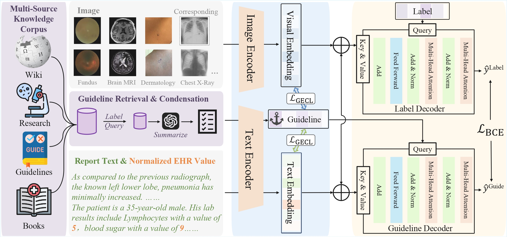

# [NeurIPS 2025] RAD
This is the code repository for our NeurIPS 2025 paper [RAD: Towards Trustworthy Retrieval-Augmented Multi-modal Clinical Diagnosis](https://openreview.net/pdf?id=Iicv9iTPcU). 

<p align="center">
  <a href="https://arxiv.org/abs/2509.19980" target="_blank"></a>
  <!-- <a href="https://paper2poster.github.io/" target="_blank"></a> -->
  <!-- <a href="https://huggingface.co/datasets/Paper2Poster/Paper2Poster" target="_blank"></a> -->
  <a href="https://huggingface.co/papers/2509.19980" target="_blank"></a>
</p>



**Abstract**: Clinical diagnosis is a highly specialized discipline requiring both domain expertise and strict adherence to rigorous guidelines. While current AI-driven medical research predominantly focuses on knowledge graphs or natural text pretraining paradigms to incorporate medical knowledge, these approaches primarily rely on implicitly encoded knowledge within model parameters, neglecting task-specific knowledge required by diverse downstream tasks. To address this limitation, we propose Retrieval-Augmented Diagnosis (RAD), a novel framework that explicitly injects external knowledge into multimodal models directly on downstream tasks. Specifically, RAD operates through three key mechanisms: retrieval and refinement of disease-centered knowledge from multiple medical sources, a guideline-enhanced contrastive loss that constrains the latent distance between multi-modal features and guideline knowledge, and the dual transformer decoder that employs guidelines as queries to steer cross-modal fusion, aligning the models with clinical diagnostic workflows from guideline acquisition to feature extraction and decision-making. Moreover, recognizing the lack of quantitative evaluation of interpretability for multimodal diagnostic models, we introduce a set of criteria to assess the interpretability from both image and text perspectives. Extensive evaluations across four datasets with different anatomies demonstrate RAD's generalizability, achieving state-of-the-art performance. Furthermore, RAD enables the model to concentrate more precisely on abnormal regions and critical indicators, ensuring evidence-based, trustworthy diagnosis. Our code is available at https://github.com/tdlhl/RAD.

## Requirements

Our environment is provided in RAD.yaml (conda) and requirements.txt (pip).

To install:
```
conda env create -f RAD.yml
```

Some key requirements:
```
torch==2.4.1+cu121
transformers==4.47.1
huggingface-hub
timm
tensorboard 
```

## Data Preprocess

Due to licensing restrictions, we cannot redistribute the datasets directly. Below are instructions to access and preprocess each dataset for reproducibility:

> MIMIC-ICD53 Dataset
- Access : The dataset will be released on [PhysioNet](https://physionet.org/) upon publication.

> SkinCAP Dataset
- Access : Request access via [HuggingFace](https://huggingface.co/datasets/joshuachou/SkinCAP ).
- License : Use restricted to non-commercial research under [CC BY-NC-SA 4.0](https://creativecommons.org/licenses/by-nc-sa/4.0/).
- Preprocessing : 
1. Download the dataset from HuggingFace.
    ```
    cd /your_path/RAD
    huggingface-cli login
    # Enter your token
    huggingface-cli download joshuachou/SkinCAP --repo-type dataset --local-dir ./preprocess/skin
    ```
2. Run the preprocessing Python code
    ```
    cd preprocess/skin
    python 0_clean_file.py
    python 1_choose_top_label.py
    python 2_convert_label_to_binary
    python 3_split_train_test.py
    ```
3. Copy the processed CSV file into the `csv_files` directory

> Harvard-FairVLMed Dataset
- Access : Apply via Harvard-FairVLMed [GitHub repository](https://github.com/Harvard-Ophthalmology-AI-Lab/FairCLIP ).

- License : Use restricted to non-commercial research under [CC BY-NC-ND 4.0](https://creativecommons.org/licenses/by-nc-nd/4.0/)

- Preprocessing : 
1. Apply for access to the dataset in their [GitHub repository](https://github.com/Harvard-Ophthalmology-AI-Lab/FairCLIP ). The original Google Drive [link](https://drive.google.com/drive/folders/1bkeifigwOAfnsLvup9mJOSNeA3WsvA2l). 
2. To process the files: We use the `note` column as text modality, the `image` column corresponding to filenames as image modality. The `use` column is the division of the training set and the test set. The `glaucoma` column is the label.
3. Put the processed CSV file into the `csv_files` directory


> NACC Dataset
- Access : Register at NACC Data [Portal](https://naccdata.org/).
- License : Use requires adherence to NACC data sharing agreements.
- Preprocessing : The code for EHR cleaning is in the `./preprocess/nacc/nacc.py` file. Please refer to the Appendix in our paper for the detailed preprocessing of NACC.


## Training Guidance:
- S1. Build the environment following the `Requirements`.

- S2. Prepare the data following the `Data Preprocess`. Make sure that the CSV file path is consistent with the corresponding yaml file in the `configs` directory.

- S3. The retrieved and refined guidelines for each dataset are provided in the `guideline` directory. To construct your own retrieval knowledge corpus, please refer to the details in our paper.

- S4. Run the sample scripts in the main directory. Taking the MIMIC-ICD53 dataset as an example, use the following command:
    ```
    cd /your_path/RAD
    sh icd.sh
    ```
    Note that our experiments are conducted on the `slurm` system; you can also run the Python file directly. And the `batch size` in `configs` should be adjusted according to the computing resources.

# Citation
If you find our work useful for your research or project, please consider giving a star ⭐ or a citation.
```
@inproceedings{
li2025rad,
title={{RAD}: Towards Trustworthy Retrieval-Augmented Multi-modal Clinical Diagnosis},
author={Haolin Li and Tianjie Dai and Zhe Chen and Siyuan Du and Jiangchao Yao and Ya Zhang and Yanfeng Wang},
booktitle={The Thirty-ninth Annual Conference on Neural Information Processing Systems},
year={2025},
url={https://openreview.net/forum?id=Iicv9iTPcU}
}
```


